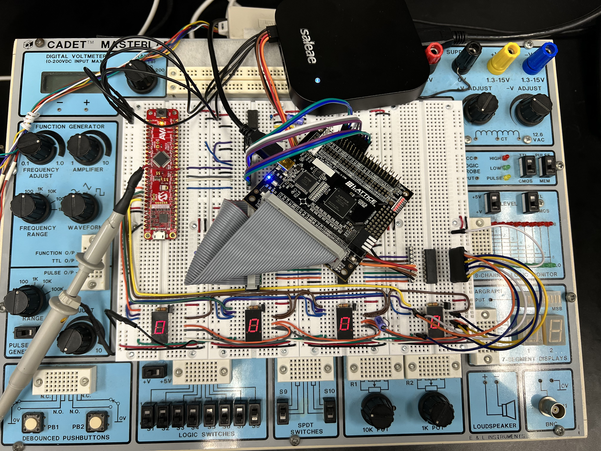

# Multi-digit Multiplexed Seven-Segment Display Driver with SPI Interface

This project is developed as part of the laboratory exercises for ESE382 Digital System Design Using VHDL and PLDs at Stony Brook University. The objective is to design a multiplexed 4-digit seven-segment display with an SPI interface, capable of displaying digits based on commands received via SPI.

## System Overview

The design uses a multiplexed approach to display digits on a seven-segment display using SPI communication. The system block diagram included in the repository provides a comprehensive view of the components and their interactions.

[View PDF](pics/block_diagram_ls (1).pdf)

### Components

- **Edge Detector (U1)**: Detects the positive edge of signals.
- **SPI RX Shifter (U2)**: Shifts in the serial data from SPI.
- **Buffer Register (U4)**: Holds the data received from the SPI interface.
- **Decoder 2-to-4 (U5)**: Decodes address bits to select one of the four digit registers.
- **Hex Digit Registers (U6, U7, U8, U9)**: Store individual digit values.
- **Digit Mux (U10)**: Selects which digit to display based on the multiplexer control signals.
- **Seven Segment Driver (U11)**: Drives the seven-segment display.

## Hardware Setup

Detailed diagrams and pictures of the actual circuit setup are provided to aid in replicating the project setup.

  

## VHDL Modules

Each component is implemented as a separate VHDL module:

- `edge_det`
- `slv_spi_rx_shifter`
- `rx_buff_reg`
- `decoder_2to4`
- `hex_digit_reg`
- `load_digit_fsm`
- `hex_dig_mux`
- `hex_seven`

## Simulation

Testbenches for each module are available under the `testbenches` directory. Instructions on running the simulations using Aldec Active-HDL are provided.

## Synthesis and Programming

Instructions on synthesizing the design for a target PLD and programming it using Lattice Diamond are included.

## Documentation

Additional documentation, including state diagrams and entity declarations for each module, can be found in the `docs` folder.

## Contributions and Licensing

Feel free to fork this project and contribute back any enhancements or bug fixes. This project is released under the MIT License.

## Acknowledgments

Special thanks to Prof. Ken Short and the TA team for their guidance and support throughout the laboratory exercises.

